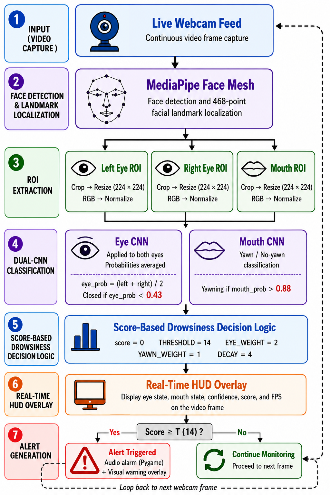
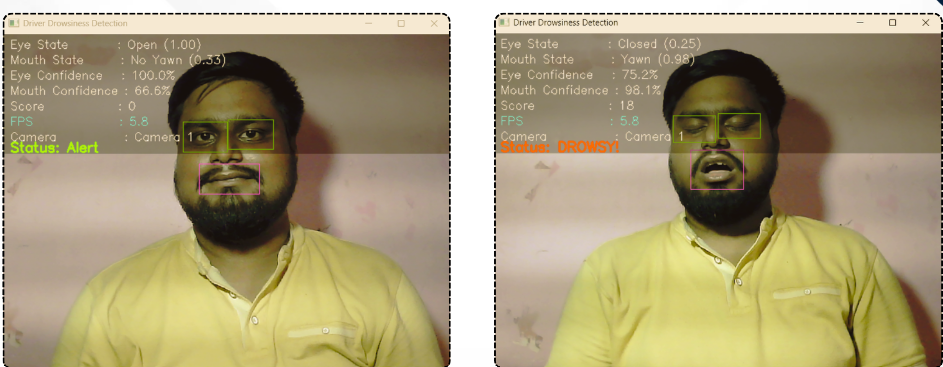
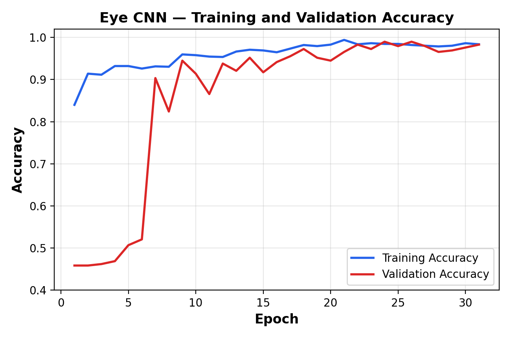
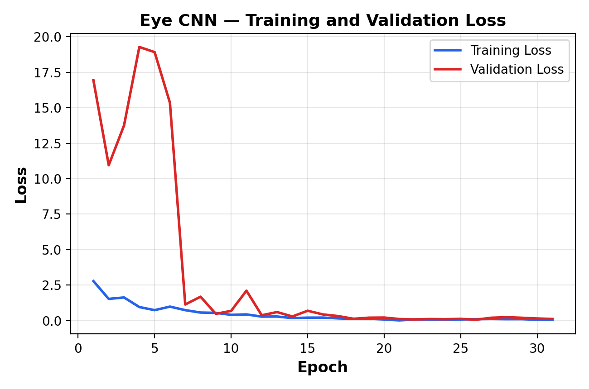
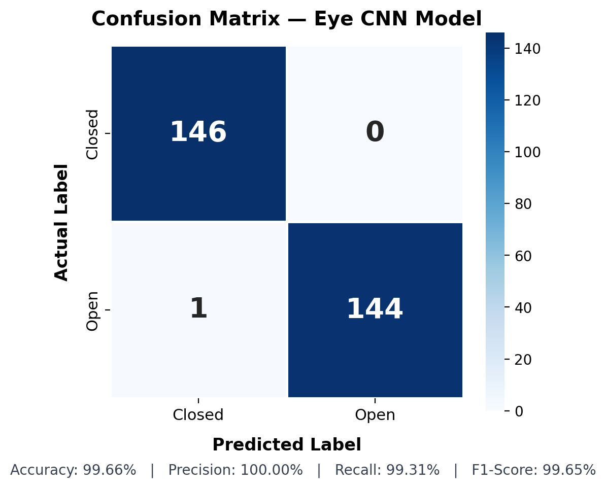
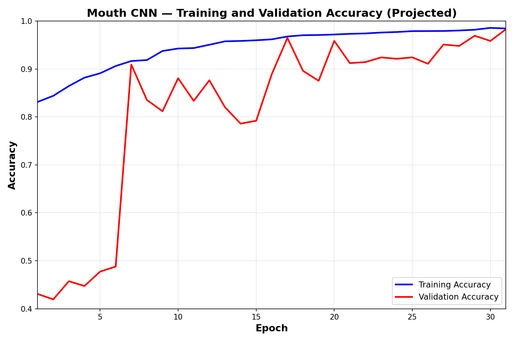

# 🚗 Driver Drowsiness Detection System

> A Real-Time Vision-Based Driver Drowsiness Detection System using **Convolutional Neural Networks (CNN)** and **MediaPipe Face Mesh** to detect driver fatigue through eye closure and yawning.


---

# 📖 Project Overview

Driver drowsiness is a major cause of road accidents. This project presents a real-time Driver Drowsiness Detection System that continuously monitors a driver's facial behavior using a webcam.

The system combines **Computer Vision**, **Deep Learning**, and **MediaPipe Face Mesh** to detect:

- 👁 Eye Closure
- 😮 Yawning
- 🚨 Driver Drowsiness

When prolonged eye closure or yawning is detected, an audio alarm alerts the driver.

---

# ✨ Features

- Real-time webcam monitoring
- CNN-based Eye State Detection
- CNN-based Yawn Detection
- Face Landmark Detection using MediaPipe Face Mesh
- Eye and Mouth ROI Extraction
- Score-Based Drowsiness Detection
- Audio Alert System
- Lightweight and Real-Time Performance

---

# 🛠 Technologies Used

| Category | Technologies |
|-----------|-------------|
| Programming Language | Python |
| Deep Learning | TensorFlow, Keras |
| Computer Vision | OpenCV |
| Face Landmark Detection | MediaPipe Face Mesh |
| Numerical Computing | NumPy |
| Visualization | Matplotlib |
| Audio Alert | Pygame |

---

# 📂 Repository Structure

```
Driver-Drowsiness-Detection/
│
├── README.md
├── LICENSE
├── requirements.txt
├── prediction.py
├── driver_drowsiness_detection.ipynb
├── alarm.wav
│
├── eye_accuracy_curve.png
├── eye_loss_curve.png
├── eye_confusion_matrix.png
│
├── mouth_accuracy_curve.png
│
├── system_architecture.png
└── system_output.png
```

---

# 🏗 System Architecture



The proposed framework consists of:

1. Webcam Image Capture
2. Face Detection
3. MediaPipe Face Mesh
4. Eye & Mouth ROI Extraction
5. CNN Prediction
6. Drowsiness Score Calculation
7. Audio Alarm Generation

---

# ▶ Usage

Clone the repository

```bash
git clone https://github.com/RAMAN70628/Driver-Drowsiness-Detection.git
```

Install dependencies

```bash
pip install -r requirements.txt
```

Run the project

```bash
python prediction.py
```

---

# 📸 Real-Time Detection

The following screenshot shows the system running in real time.



---

# 📊 Eye CNN Performance

## Accuracy Curve



## Loss Curve



## Confusion Matrix



---

# 📊 Mouth CNN Performance

## Accuracy Curve



---

# 📈 Results

The developed Driver Drowsiness Detection System successfully performs:

- Real-time Eye Closure Detection
- Real-time Yawn Detection
- Accurate CNN Classification
- Reliable Driver Monitoring
- Instant Alarm Generation

The integration of CNN models with MediaPipe Face Mesh enables efficient real-time monitoring while maintaining lightweight computational requirements.

---

# 📌 Dataset

The project uses separate image datasets for:

### Eye Dataset
- Open Eyes
- Closed Eyes

### Mouth Dataset
- Yawn
- No Yawn

All images are resized, normalized, and augmented before CNN training.

---

# 🧠 Model Training

The CNN models were trained using the included Jupyter Notebook.

```
driver_drowsiness_detection.ipynb
```

---

# 📦 Trained Models

The trained CNN model files (`eye_model.h5` and `mouth_model.h5`) are not included in this repository because of GitHub file size limitations.

You can train the models using the provided notebook and place the generated model files in the project directory before running the application.

---

# 🚀 Future Enhancements

- Mobile Application
- Raspberry Pi Deployment
- Infrared Camera Support
- Head Pose Estimation
- Blink Rate Analysis
- Driver Attention Monitoring
- TensorRT Optimization
- Embedded Vehicle Integration

---

# 📜 License

This project is licensed under the MIT License.

---

# 👨‍💻 Author

**Ramendra Raman Saha**

B.Tech in Computer Science & Engineering

Netaji Subhash Engineering College

GitHub: https://github.com/RAMAN70628

---

⭐ If you found this project useful, consider giving it a **Star**.
